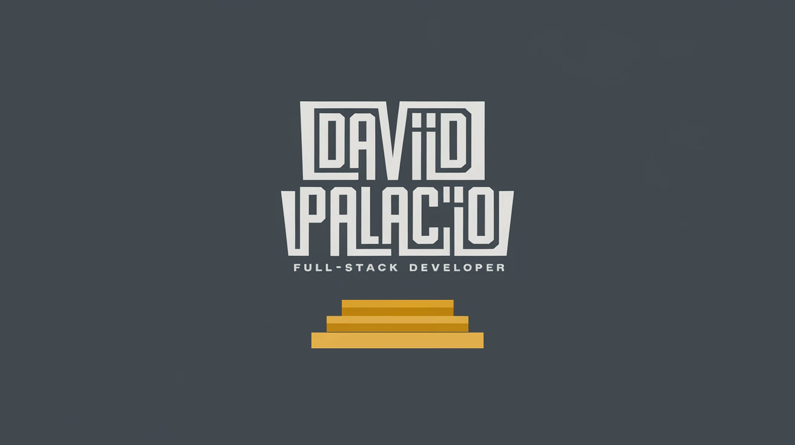

<h1 align="center">Hi 👋, I'm David</h1>

<h3 align="center">A passionate frontend developer from Colombia</h3>

- 🌱 I’m currently learning **Angular 18, SolidJS**

- 🤝 I’m looking for help with **Angular**

- 💬 Ask me about **Javascript, React,**

- 📫 How to reach me **davidspalaciof@gmail.com**

- ⚡ Fun fact **I am excited to leave traces of creativity in every creation and idea.**

<h3 align="left">Languages and Tools:</h3>

                          

